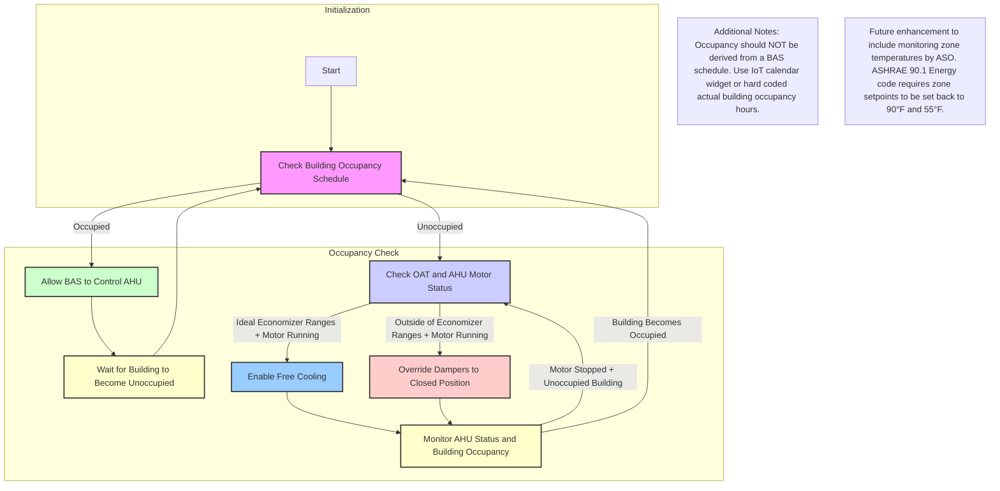

## AHU Night Recirculation Mode Control Algorithm

This repository provides a tutorial on implementing the **Air Handling Unit (AHU) Night Recirculation Mode Control Algorithm** for HVAC systems. The algorithm ensures energy efficiency by overriding AHU dampers to operate in full recirculation air mode during unoccupied hours when the AHU is active.

---

### Key Insights
- **Energy Efficiency**: Ensures AHU dampers remain closed during unoccupied hours to prevent unnecessary outdoor air intake and conserve energy.
- **Optimized Control**: Overrides AHU dampers to full recirculation mode during night-time heating or cooling cycles.
- **Flexible Scheduling**: Integrates with Building Automation Systems (BAS), IoT calendar widgets, or hardcoded schedules.

---

## Activity Diagram of AHU Night Recirculation Mode Control Process

<details>
  <summary>AHU Control Logic</summary>



</details>

---

## Control Logic Details

<details>
  <summary>Algorithm Details</summary>

### Aim
Ensure AHUs operate in full recirculation air mode during unoccupied hours to conserve energy.

---

### Level of Complexity
Low

---

### Potential Savings
Moderate

---

### Process
1. **Check Current Time**:
   - Compare the current time against the building schedule sourced from:
     - BAS using BACnet or similar protocols.
     - IoT calendar widget (preferred).
     - Hardcoded values.
2. **Monitor AHU Activity**:
   - If the AHU is active during unoccupied hours due to a heating or cooling call, override the air dampers to **closed** for full recirculation mode.
3. **Occupied Schedule**:
   - During occupied hours, release damper control back to the BAS for normal operation.

</details>

---

### Adjustable Algorithm Variables

| **Variable**                            | **Description**                                              | **Default Value**      |
|-----------------------------------------|--------------------------------------------------------------|------------------------|
| **Building Start Time**                 | The time when the building becomes occupied.                 | `7:00 AM`             |
| **Building End Time**                   | The time when the building becomes unoccupied.               | `6:00 PM`             |
| **Days of Week**                        | Days when the building is occupied.                          | `Monday-Friday`       |
| **Economizer High Limit Temperature**   | The maximum outdoor air temperature for enabling free cooling.| `60°F`                |
| **Economizer Low Limit Temperature**    | The minimum outdoor air temperature for enabling free cooling.| `50°F`                |

---

### Python and JavaScript Implementation

<details>
  <summary>Example Python Implementation</summary>

```bash
$ python night_recirc_mode.py
```

Example Output:
```
Starting Night Recirculation Mode Control Simulation...
Wednesday 18:26: Building is unoccupied. AHU is inactive. No action required.
Friday 21:52: Building is unoccupied. AHU is inactive. No action required.
Wednesday 03:28: Building is unoccupied. AHU is active. Free cooling disabled (OAT: 43.25°F). Dampers_Closed
Monday 10:12: Building is occupied. Release_Control
```

</details>

<details>
  <summary>Example JavaScript Implementation</summary>

```bash
$ node nightRecircMode.js
```

Example Output:
```
Current Time: 3:00 AM
Building Status: Unoccupied
AHU Status: Active
Damper Override: Dampers Closed for Full Recirculation Mode
...
```

</details>

---

### Haystack Data Model

<details>
  <summary>Haystack Marker Tags</summary>

| **Point Name**                               | **navName**               | **Marker Tags in Haystack**                     |
|----------------------------------------------|---------------------------|------------------------------------------------|
| **Building Occupancy Schedule**              | `buildingOccSchedule`     | `sp`                                          |
| **AHU/RTU Operating Status**                 | `ahuRtuStatus`            | `ahu`, `rtu`, `status`, `cmd`                 |
| **Minimum Outdoor Air Damper Setpoint**      | `minOaDamperSp`           | `ahu`, `rtu`, `damper`, `outdoor`, `sp`       |
| **Outdoor Air Damper Command**               | `oaDamperCmd`             | `ahu`, `rtu`, `damper`, `outdoor`, `cmd`      |
| **Outside Air Temperature**                  | `outsideAirTemp`          | `outside`, `air`, `temp`, `sensor`            |
| **Economizer High Limit Temperature**        | `economizerHighLimitTemp` | `ahu`, `economizer`, `temp`, `high`, `limit`  |
| **Economizer Low Limit Temperature**         | `economizerLowLimitTemp`  | `ahu`, `economizer`, `temp`, `low`, `limit`   |

</details>

---

### Notes

This algorithm is ideal for ensuring energy-efficient operation of AHUs during unoccupied hours, aligning with best practices for reducing HVAC runtime. Future enhancements could include incorporating zone temperature monitoring for further optimization.
