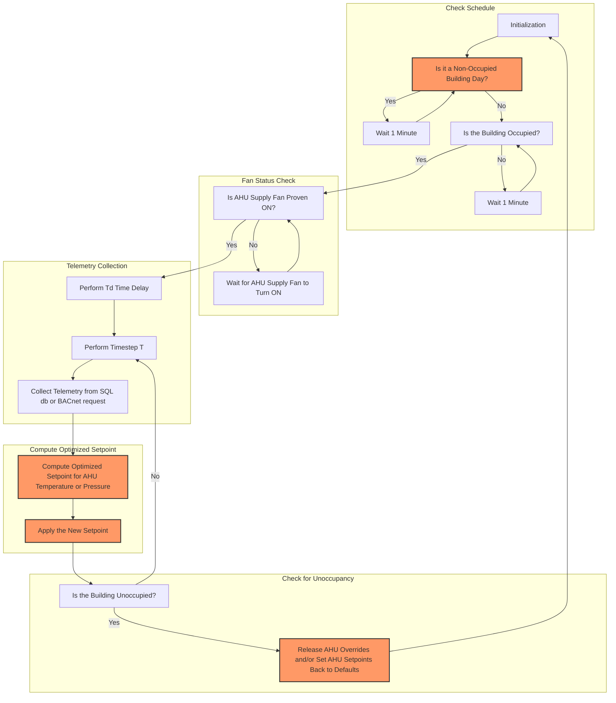

## Duct Static Pressure Reset Algorithm for HVAC Systems

This repository provides a tutorial on implementing the **Duct Static Pressure Reset Algorithm** for HVAC systems, inspired by industry best practices and ASHRAE Guideline 36. The strategy dynamically adjusts supply air static pressure to optimize energy consumption while maintaining zone comfort. This documentation is designed for skilled professionals in HVAC, Building Automation Systems (BAS), Automated Supervisory Optimization (ASO), and IoT who wish to learn the mechanics of this algorithm.



## Key Insights
- **Energy Efficiency**: Reduces fan energy consumption while ensuring sufficient airflow to VAV zones.
- **Inputs from BAS Telemetry**: Zone damper positions and static pressure data are expected to come from sensors ingested into a local BAS system and stored in an SQL database.
- **Compliance with Standards**: Inspired by ASHRAE Guideline 36 for advanced HVAC optimization strategies.

## Overview of the Algorithm
The Duct Static Pressure Reset Algorithm calculates the optimal setpoint for supply air duct static pressure by leveraging the following inputs:
- **Zone Damper Positions**: Average or worst-case scenario for VAV box dampers.
- **Static Pressure Limits**: Defined minimum and maximum setpoints to maintain system safety and performance.
- **Device Status**: Ensures adjustments are only made when the associated fan or pump is active.

The algorithm dynamically trims or responds to requests from zones, ensuring most dampers operate within an optimal range of 50-75% open.

## Required Inputs
### SQL Database Schema
The algorithm assumes an SQL database containing the following table:

| Column Name           | Data Type | Description                                              |
|-----------------------|-----------|----------------------------------------------------------|
| `damper_positions`    | FLOAT     | Current VAV damper positions as a percentage (0-1).      |
| `static_pressure`     | FLOAT     | Current duct static pressure in inches WC.               |
| `device_status`       | BOOLEAN   | Status of the associated device (on/off).                |
| `timestamp`           | DATETIME  | Timestamp of the recorded data.                          |

### Example SQL Query
```sql
SELECT damper_position, static_pressure, device_status
FROM duct_static_pressure_data
WHERE timestamp >= NOW() - INTERVAL 7 DAY;
```
This query retrieves a week's worth of historical data required for proper parameter tuning.

## How the Algorithm Works
1. **Historical Data Retrieval**:
   - The algorithm queries the SQL database to fetch the historical data.
   - At least one week's worth of data is needed for effective parameter tuning.

2. **Dynamic Adjustment**:
   - The algorithm monitors damper positions across zones. If the average damper position is below 50%, the static pressure setpoint is decreased. If the average is above 75%, the setpoint is increased.
   - Trimming and responding logic ensures changes occur incrementally to maintain stability.

3. **Limits Enforcement**:
   - The adjusted static pressure is clamped within defined limits (e.g., SPmin and SPmax).

## Adjustable Algorithm Variables

| Variable             | Description                                                    | Default Value         |
|----------------------|----------------------------------------------------------------|-----------------------|
| **SP0**              | Initial static pressure setpoint                               | `0.5” WC`            |
| **SPmin**            | Minimum allowable static pressure                              | `0.15” WC`           |
| **SPmax**            | Maximum allowable static pressure                              | `1.5” WC`            |
| **Td**               | Delay timer before logic activates                             | `5 minutes`          |
| **T**                | Time step for evaluating trim and respond logic                | `2 minutes`          |
| **I**                | Number of ignored requests (highest damper positions)          | `2`                  |
| **SPtrim**           | Amount by which the setpoint is trimmed if below thresholds    | `-0.02” WC`          |
| **SPres**            | Amount by which the setpoint is increased if above thresholds  | `0.04” WC`           |
| **SPres-max**            | Maximum amount of change allowed per time step  | `0.15” WC`           |
| **HighDamperSpt**    | Damper position threshold to generate requests (dpr > 85%)     | `0.85%`              |


## Implementation

#### Python
```bash
$ python ahu_temperature_reset_sim.py
```

#### JavaScript
```bash
$ node ahuTemperatureResetSim.js
```

#### Java
```bash
# compile
$ javac javac AHUStaticPressureSimulation.java

# run
$ java AHUStaticPressureSimulation
```

#### Example Output Per Timestep
```
Ignored Damper Positions: [0.92, 0.91]
Max Damper Position (After Excluding Top 2): 0.87
Net Requests (Factoring Ignored Dampers): 1
Total Adjustment is 0.06 Inch WC
We need more static!...
Previous Static Pressure Setpoint: 1.50” WC
Current Static Pressure Setpoint: 1.50” WC (increased)

Ignored Damper Positions: [0.92, 0.84]
Max Damper Position (After Excluding Top 2): 0.82
Net Requests (Factoring Ignored Dampers): 0
Total Adjustment is -0.02 Inch WC
We need less static!...
Previous Static Pressure Setpoint: 1.50” WC
Current Static Pressure Setpoint: 1.48” WC (decreased)

Ignored Damper Positions: [0.94, 0.93]
Max Damper Position (After Excluding Top 2): 0.87
Net Requests (Factoring Ignored Dampers): 2
Total Adjustment is 0.12 Inch WC
We need more static!...
Previous Static Pressure Setpoint: 1.48” WC
Current Static Pressure Setpoint: 1.50” WC (increased)

Ignored Damper Positions: [0.94, 0.93]
Max Damper Position (After Excluding Top 2): 0.91
Net Requests (Factoring Ignored Dampers): 5
Total Adjustment is 0.15 Inch WC
We need more static!...
Previous Static Pressure Setpoint: 1.50” WC
Current Static Pressure Setpoint: 1.50” WC (increased)
...
```

---

## Trim & Respond Logic Details

### Aim
Reduce fan energy consumption by dynamically adjusting duct static pressure setpoints.

### Level of Complexity
(High)

### Potential Savings
(High)

### Process
The algorithm evaluates VAV box damper positions across zones. If the average damper position is:
- **Below 50%**: Decrease static pressure setpoint.
- **Above 75%**: Increase static pressure setpoint.

Adjustments occur incrementally to maintain system stability, with limits enforced to prevent excessive changes.

---

## Data Model in Haystack

**Note:** The algorithm requires proper Haystack markers and tags for AHU leaving air duct static pressure and **ALL** VAV box air damper commands associated with that AHU within the duct system.

| **Point Name**                           | **navName**             | **Marker Tags in Haystack**                     |
|------------------------------------------|-------------------------|------------------------------------------------|
| **AHU Leaving Air Duct Static Pressure** | `ahuDuctStaticPress`    | `ahu`, `duct`, `static`, `pressure`, `sensor`  |
| **AHU Leaving Air Duct Static Pressure Setpoint** | `ahuDuctStaticPressSp` | `ahu`, `duct`, `static`, `pressure`, `sp`      |
| **VAV Box Air Damper Command**           | `vavAirDamperCmd`       | `vav`, `air`, `damper`, `cmd`                  |


### Notes

This algorithm is designed for occupied buildings and should be carefully tuned, particularly the ignore variable (`I`), to ensure occupant comfort is maintained. It is also recommended to follow up with an occupant comfort survey to confirm that zones do not feel too hot, cold, muggy, dry, or experience any other occupant comfort issues.