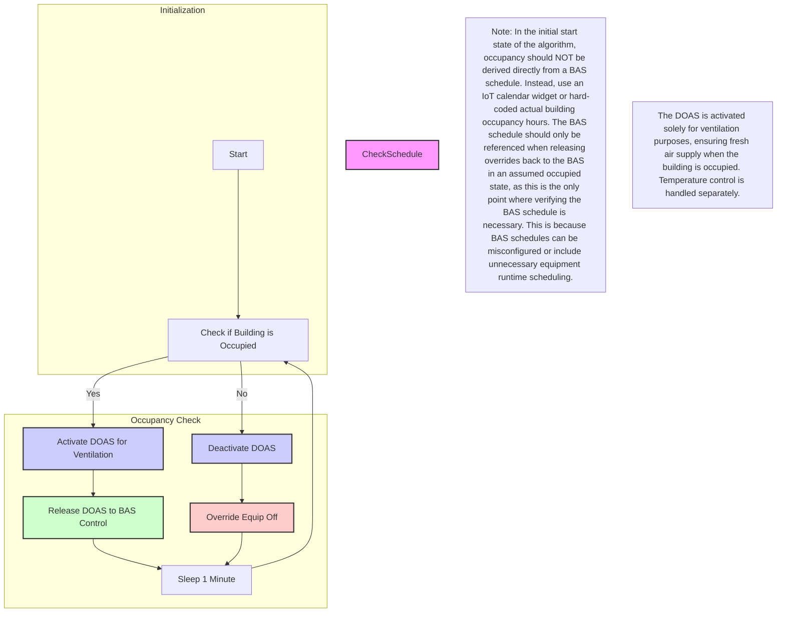

## DOAS Unit Control Algorithm for Fresh Air Ventilation

This repository provides a tutorial on implementing the **Dedicated Outside Air System (DOAS) Control Algorithm** for HVAC systems. The algorithm ensures the DOAS unit operates only during building occupancy, providing fresh air ventilation without temperature control. This method improves energy efficiency while maintaining indoor air quality.

---

### Key Insights
- **Ventilation-Only Purpose**: The DOAS unit operates solely to provide fresh air during occupancy. It does not control heating or cooling.
- **Occupancy-Based Operation**: Activates DOAS only when the building is occupied, ensuring efficient ventilation.
- **Flexible Scheduling**: Integrates with Building Automation Systems (BAS), IoT calendar widgets, or hardcoded schedules.

---

## Activity Diagram of DOAS Control Process

<details>
  <summary>DOAS Control Logic</summary>



</details>

---

## Control Logic Details

<details>
  <summary>Algorithm Details</summary>

### Aim
Ensure the DOAS unit operates only when the building is occupied to minimize energy use while maintaining ventilation requirements.

---

### Level of Complexity
Low

---

### Potential Savings
Moderate

---

### Process
1. **Check Current Time**: Compare the current time against the building schedule sourced from:
   - **BAS**: Using BACnet or similar protocols.
   - **IoT Calendar Widget**: For user-configurable schedules.
   - **Hardcoded Values**: Directly set start/stop times and occupied days.
2. **Apply Overrides**:
   - **If Unoccupied**: Override the occupancy command to turn the DOAS unit off.
   - **If Occupied**: Release the control back to the BAS to operate normally.

---

### Adjustable Algorithm Variables
- **Building Start Time**: Defines when occupancy begins.
- **Building End Time**: Defines when occupancy ends.
- **Days of Week**: Specifies occupied days.
- **Override Command**: Command to turn off the DOAS unit.
- **Release Command**: Command to allow normal BAS operation.

</details>

---


### Python and JavaScript Implementation

<details>
  <summary>Example Python Implementation</summary>

```bash
$ python doas_unit_control.py
```

Example Output:
```
Starting DOAS Unit Control...
Monday 07:00: Building is occupied. Release to BAS control. Command: Release_Control
Monday 19:00: Building is unoccupied. Override equipment off. Command: DOAS_Off
Tuesday 07:00: Building is occupied. Release to BAS control. Command: Release_Control
...
```

</details>

<details>
  <summary>Example JavaScript Implementation</summary>

```bash
$ node doasUnitControl.js
```

Example Output:
```
Starting DOAS Unit Control Simulation...
Monday 07:00: Building is occupied. Release to BAS control. Command: Release_Control
Monday 19:00: Building is unoccupied. Override equipment off. Command: DOAS_Off
...
```

</details>

---

### Scheduling Inputs

<details>
  <summary>Dynamic Schedule Sources</summary>

The DOAS algorithm allows schedules to be sourced dynamically from:
- **Building Automation System (BAS)**: Using BACnet or similar communication protocols.
- **IoT Calendar Widget**: For user-configurable schedules.
- **Hardcoded Values**: Static start/stop times and occupied days.

</details>

---

### Applicability Notes

<details>
  <summary>Applicability and Flexibility</summary>

This algorithm is ideal for standalone DOAS units in HVAC systems that use:
- **Heat Pumps**
- **VRF Technologies**

It provides flexible scheduling to ensure ventilation tailored to the building’s occupancy patterns.

</details>

---

### Haystack Data Model

<details>
  <summary>Haystack Marker Tags</summary>

The algorithm requires proper Haystack markers and tags for managing the DOAS unit operation effectively:

| **Point Name**                        | **navName**             | **Marker Tags in Haystack**               |
|---------------------------------------|-------------------------|--------------------------------------------|
| **Building Occupancy Schedule**       | `buildingOccSchedule`   | `schedule`, `building`, `occ`             |
| **DOAS Occupancy Command**            | `doasOccCmd`            | `doas`, `occ`, `cmd`                      |
| **DOAS Status**                       | `doasStatus`            | `doas`, `status`                          |

</details>


### Notes
* This algorithm is ideal for scenarios requiring fresh air ventilation in occupied buildings that use Dedicated Outside Air Systems (DOAS), which are common in heat pump or VRF-based HVAC systems, such as office spaces, schools, and retail environments. It minimizes unnecessary runtime during unoccupied periods, ensuring energy efficiency while maintaining indoor air quality. The operation of the DOAS unit is strictly limited to ventilation purposes, not heating or cooling.

* In the initial start state of the algorithm, occupancy should NOT be derived directly from a BAS schedule. Instead, use an IoT calendar widget or hard-coded actual building occupancy hours. The BAS schedule should only be referenced when releasing overrides back to the BAS in an assumed occupied state, as this is the only point where verifying the BAS schedule is necessary. This is because BAS schedules can be misconfigured or include unnecessary equipment runtime scheduling.