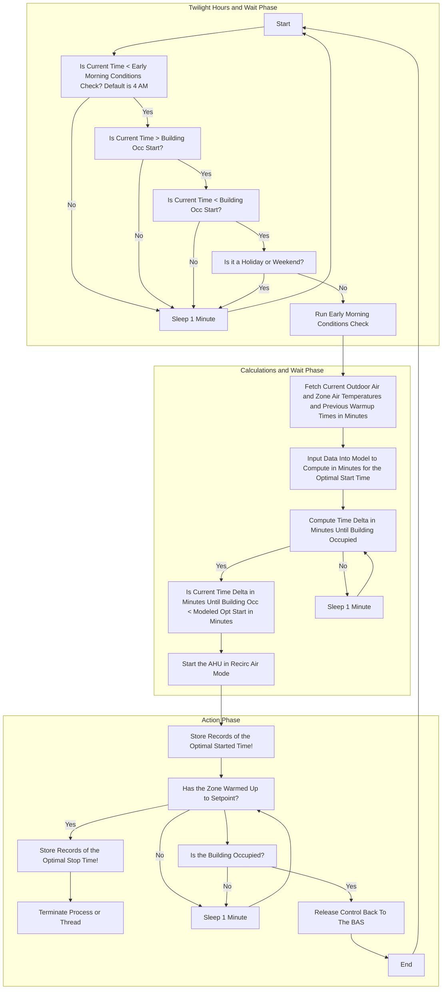

## Model 3 Optimal Start Strategy for HVAC Systems

This repository provides a tutorial on implementing the **Model 3 Optimal Start Strategy** for HVAC systems, inspired by the work of the Pacific Northwest National Laboratory (PNNL). The strategy determines the best preconditioning time to warm or cool a building before occupancy, based on historical data and dynamic parameter tuning. The algorithm is designed for skilled professionals in HVAC, Building Automation Systems (BAS), Automated Supervisory Optimization (ASO), and IoT who wish to learn the mechanics of this algorithm.

## Activity Diagram of Entire Process

<details>
  <summary>Algorithm Activity Process</summary>


</details>


## PNNL Model Key Insights

<details>
  <summary>Mathematics Modeling Details</summary>

- **Dynamic Tuning**: Parameters adapt over time, using a week's worth of historical data for proper tuning. Potentially more data could be used in creating better models. Minimum is 7 days but algorithm could default to 15 days data.
- **Inputs from BAS Telemetry**: Outdoor air temperature and zone temperature data are expected to come from sensors ingested into a local BAS system and stored in an SQL database.
- **Citing PNNL**: This work builds on concepts developed by PNNL for advancing energy-efficient and grid-interactive buildings. Visit the [PNNL VOLTTRON documentation](https://volttron.readthedocs.io/en/main/) for more insights. Also see the `Optimal Start Control for ACs and HPs.pdf` in this repo directory.

## Overview of Model 3
The Model 3 algorithm calculates the optimal start time for HVAC systems by leveraging the following inputs:
- **Outdoor Air Temperature**: Current temperature outside the building at the time of the algorithm execution.
- **Zone Air Temperature**: Current indoor temperature at the time of the algorithm execution.
- **Occupied Setpoint Temperature**: Desired indoor temperature by occupancy time or occupied zone air tempertaure setpoint.
- **Warm Up Time In Minutes**: Time in minutes from previous warm up events.

The algorithm dynamically tunes three key parameters:
- **`alpha_3a`**: Time required to change the indoor temperature by 1 degree (**measured in minutes**).
- **`alpha_3b`**: Influence of outdoor temperature on the indoor temperature change (**measured in degrees Fahrenheit**).
- **`alpha_3d`**: Dynamic offset for start time adjustments (**measured in minutes**).

These parameters are updated using exponential smoothing based on the historical data.

## Required Inputs
### SQL Database Schema
The algorithm assumes an SQL database containing the following table:

| Column Name                   | Data Type | Description                                      |
|-------------------------------|-----------|--------------------------------------------------|
| `outdoor_temp`                | FLOAT     | Outdoor air temperature in degrees Fahrenheit.   |
| `zone_temp`                   | FLOAT     | Zone air temperature in degrees Fahrenheit.      |
| `warmup_time_minutes_history` | INT       | Captured preconditioning duration in minutes.    |
| `timestamp`                   | DATETIME  | Timestamp of the recorded data.                  |

### Example SQL Query
```sql
SELECT outdoor_temp, zone_temp, warmup_time_minutes
FROM hvac_historical_data
WHERE timestamp >= NOW() - INTERVAL 7 DAY;
```
This query retrieves a week's worth of historical data required for proper parameter tuning.

---

### Adjustable Algorithm Variables

| **Variable**             | **Description**                                              | **Default Value**       |
|---------------------------|--------------------------------------------------------------|-------------------------|
| **Building Occ Start**      | Defines the building occupancy start time as specified by the BAS schedule. | `H:MM`                |
| **Earliest Equip Start**    | The earliest time before `buildingOccStart` when equipment can begin operation. | `90 minutes before buildingOccStart` |
| **Early Morning Conditions Check** | A time (default: 4:00 AM) when the current outside air temperature and zone air temperature are assessed to calculate the optimal start time in minutes. | `4:00 AM`             |
| **Zone Temp Offset Ignore**  | Threshold value (in degrees) to bypass optimal start if the deviation is less than this value. | `1°F`                 |
| **Warmup Time Minutes History** | Time (in minutes) required to precondition zones before occupancy, retrieved or calculated from historical data. | `Variable`            |

---

## Python Implementation

### Running the Script
```bash
$ python pnnl_model3_method.py
```

### Example Py Output
```
Optimal Start Time in Minutes: 180.00
Parameters: alpha_3a=7.76, alpha_3b=2.44, alpha_3d=-628.77
```

## JavaScript Implementation

### Running the Script
```bash
$ node pnnlModel3.js 
```

### Example Js Output
```
Optimal Start Time in Minutes: 180
Parameters: alpha3a=7.76, alpha3b=2.44, alpha3d=-628.77
```

</details>

---

## Optimum Start/Stop Algorithm

<details>
  <summary>Algorithm Details</summary>

### Aim
Reduce equipment runtime & energy use building-wide

### Level of Complexity
(High)

### Potential Savings
(High)

### Process

Automatically calculates the ideal equipment start time each day to ensure appropriate temperatures by the specified occupied time. The program learns the recovery rate of the space based on previous days' rates and automatically adjusts for differing outdoor air temperatures. The algorithm works as follows:

1. **Historical Data Retrieval**:
   - Queries the SQL database to fetch at least one week's worth of data.
   - Data includes outdoor air temperatures, indoor zone temperatures, and historical warm-up times.

2. **Parameter Tuning**:
   - Dynamically updates parameters (`alpha_3a`, `alpha_3b`, and `alpha_3d`) using exponential smoothing.
   - Compares historical warm-up times with outdoor and indoor temperature differences to refine calculations.

3. **Optimal Start Time Calculation**:
   - Applies tuned parameters to calculate the required preconditioning time.
   - Ensures the calculated start time remains within defined limits (e.g., no earlier than 180 minutes before occupancy).

---

### Data Model in Haystack

**Note:** Zone air temperatures can be averaged or use the worst-case scenario VAV box in the system (e.g., zones with two exterior walls, etc.).

| **Point Name**                       | **navName**   | **Marker Tags in Haystack**           |
|--------------------------------------|---------------|----------------------------------------|
| **Zone Temperature**                 | `ZnTemp`      | `zone`, `air`, `temp`, `sensor`       |
| **Zone Temperature Setpoint Effective** | `ZnTempSp`   | `zone`, `air`, `temp`, `effective`, `sp` |
| **Zone Temp Occupied Cooling Setpoint** | `OccCoolSp` | `zone`, `air`, `temp`, `occ`, `cooling`, `sp` |
| **Zone Temp Occupied Heating Setpoint** | `OccHeatSp` | `zone`, `air`, `temp`, `occ`, `heating`, `sp` |
| **Zone Temp Effective Cooling Setpoint** | `EffClgSp`  | `zone`, `air`, `temp`, `occ`, `cooling`, `sp` |
| **Zone Temp Effective Heating Setpoint** | `EffHtgSp`  | `zone`, `air`, `temp`, `occ`, `heating`, `sp` |

---

### AHU Controller
The AHU will receive zone air temperature data from the BAS supervisory controller, enabling it to perform night heating or cooling cycles as part of the unoccupied building sequencing.

- **Writable Variable:** Zone air temperature setpoint (on AHU controller)
  - Point Name: ZoneTempSp
  - Marker Tags: zone, air, temp, effective, sp
- **Read-Only Variables:**
  - Outside Air Temperature (OaTemp): outside, air, temp, sensor

---

### Details
- The algorithm monitors the time and evaluates conditions at `earlyMorningConditionsCheck`. 
- The decision to bypass optimal start is based on:
  - Holiday/weekend (BAS schedule)
  - Mild zone air temperature deviations (temperature difference < `zoneTempOffsetIgnore`)
- **Algorithm or IoT must be able to store previous time deltas or time required in minutes for how long it takes to warm up the zone to the occupied zone air temperature setpoint.** If it a heating season warmup the algorithm or IoT would be calculating time required to warm up the **Zone Temp Effective Heating Setpoint.** If this is a cooling application in calculating minutes required to cool down the zone prior to occupancy the algorithm or IoT would be calculating time required in minutes to cool down to the **Zone Temp Effective Cooling Setpoint.** Typically in BAS effective heating or cooling setpoints factor in a deadband of about +- 2°F of the actual zone temperature setpoints to come up with effective heating or cooling setpoints.

### Data Retrieval
- Retrieves historical data from an SQL database during warm-up or cool-down phases.
- Queries include:
  - Outside air temperature at the start of the procedure
  - Zone air temperature at the start of the procedure
  - Time required to reach the setpoint or time remaining until `buildingOccStart`

If no historical data is available, the equipment starts at `earliestEquipStart`, calculated dynamically.

</details>
